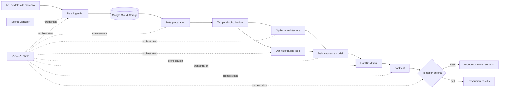

# Software_AI — MLOps para series temporales financieras

Pipeline modular de **Machine Learning / MLOps** desarrollado en Python para experimentar con series temporales financieras. El proyecto integra ingestión de datos, preparación, optimización de hiperparámetros y arquitectura, entrenamiento, filtrado de predicciones, backtesting y promoción de modelos sobre servicios de Google Cloud.

> **Estado:** proyecto experimental de investigación y desarrollo. El objetivo del repositorio es demostrar arquitectura, automatización y prácticas de ingeniería de datos/ML; no constituye un sistema de inversión listo para producción ni una recomendación financiera.

## Qué demuestra este proyecto

- Diseño de pipelines reproducibles con **Kubeflow Pipelines (KFP)**.
- Orquestación de ejecuciones mediante **Vertex AI Pipelines**.
- Ingestión de datos de mercado mediante API y manejo seguro de secretos con **Google Secret Manager**.
- Persistencia y versionado de artefactos en **Google Cloud Storage (GCS)**.
- Preparación de datos y separación temporal entre entrenamiento y holdout.
- Optimización de hiperparámetros con **Optuna**.
- Modelado con **TensorFlow/Keras**, incluyendo Conv1D, BiLSTM y Multi-Head Attention.
- Modelo de filtrado supervisado con **LightGBM**.
- Backtesting y lógica de promoción de modelos.
- Contenedorización con **Docker**.
- Organización por componentes desacoplados, configuración centralizada y pruebas automatizadas.

## Arquitectura general



## Flujo del pipeline

1. **Data ingestion** obtiene series temporales desde la fuente externa, aplica reintentos y guarda artefactos en GCS.
2. **Data preparation** limpia y estructura los datos, controla duplicados y crea conjuntos temporales para entrenamiento y validación/holdout.
3. **Architecture optimization** explora configuraciones del modelo secuencial con Optuna.
4. **Trading-logic optimization** ajusta parámetros relacionados con la lógica experimental del modelo.
5. **Training** entrena la arquitectura secuencial seleccionada.
6. **Filter model** usa las salidas del modelo principal como señales de entrada para un clasificador LightGBM.
7. **Backtesting** evalúa el comportamiento del pipeline sobre datos fuera de muestra según las reglas implementadas.
8. **Model promotion** centraliza la decisión de promover o conservar un modelo como experimento.

## Stack tecnológico

| Área | Tecnologías |
|---|---|
| Lenguaje | Python 3.10+ |
| Datos | Pandas, NumPy, PyArrow, SciPy |
| Machine Learning | scikit-learn, LightGBM, Optuna |
| Deep Learning | TensorFlow/Keras, PyTorch |
| MLOps / Orquestación | Kubeflow Pipelines, Vertex AI |
| Cloud | Google Cloud Storage, Secret Manager, Pub/Sub |
| Contenedores | Docker |
| Calidad | pytest, logging, configuración modular |

## Estructura relevante

```text
Software_AI/
├── src/
│   ├── components/
│   │   ├── data_ingestion/
│   │   ├── data_preparation/
│   │   ├── optimize_model_architecture/
│   │   ├── optimize_trading_logic/
│   │   ├── backtest/
│   │   └── model_promotion/
│   ├── pipeline/
│   └── shared/
├── tests/
├── docs/
├── Dockerfile
├── pyproject.toml
└── requirements.txt
```

Los archivos JSON compilados de KFP son **artefactos generados** durante la ejecución y no se versionan, porque pueden incorporar valores específicos del entorno. El código fuente de la pipeline permanece en `src/pipeline/main.py`.

## Configuración segura y portable

El repositorio no contiene credenciales reales ni depende de identificadores de una cuenta GCP concreta. La infraestructura se parametriza mediante variables de entorno.

Copia el archivo de ejemplo y completa los valores únicamente en tu entorno local:

```bash
cp .env.example .env
```

En PowerShell:

```powershell
Copy-Item .env.example .env
```

Variables principales:

```text
GCP_PROJECT_ID=your-gcp-project-id
GCP_REGION=europe-west1
GCS_BUCKET_NAME=your-gcs-bucket
VERTEX_SERVICE_ACCOUNT=your-service-account@your-gcp-project-id.iam.gserviceaccount.com
POLYGON_API_KEY_SECRET_NAME=polygon-api-key
ARTIFACT_REPOSITORY=mlops-images
PIPELINE_IMAGE_NAME=software-ai-pipeline
```

El archivo `.env` está excluido de Git. El `Dockerfile`, los scripts de lanzamiento y las definiciones de componentes usan valores proporcionados en runtime en lugar de IDs personales hardcodeados.

## Instalación

```bash
python -m venv .venv
```

Linux/macOS:

```bash
source .venv/bin/activate
```

Windows PowerShell:

```powershell
.\.venv\Scripts\Activate.ps1
```

Instalación del paquete:

```bash
python -m pip install --upgrade pip
pip install .
```

El pipeline utiliza **Kubeflow Pipelines 2.x** y requiere `kfp>=2.13.0` para las APIs usadas en la composición.

## Ejecución y pruebas

La entrada principal del pipeline se encuentra en `src/pipeline/main.py`. La ejecución completa requiere un proyecto de Google Cloud configurado con los permisos y recursos descritos en las variables de entorno.

Para compilar/ejecutar se proporciona una imagen común a todos los componentes mediante `--common-image-uri`. En Windows también puede utilizarse `run_pipeline.ps1`, que construye y publica la imagen usando la configuración del entorno.

Para ejecutar las pruebas disponibles:

```bash
pytest
```

## Decisiones de ingeniería destacables

- Separación de componentes de pipeline para reducir acoplamiento.
- Uso de almacenamiento de artefactos en lugar de intercambio de estado implícito entre etapas.
- Separación temporal de datos para reducir riesgo de fuga de información en series temporales.
- Gestión de secretos fuera del código fuente.
- Configuración de infraestructura mediante variables de entorno.
- No versionar especificaciones compiladas dependientes del entorno.
- Registro de correcciones y decisiones técnicas en `docs/`.

Para un ejemplo de depuración de una versión del pipeline, consulta [docs/Pipeline_v5_error_fix.md](docs/Pipeline_v5_error_fix.md).

## Desarrollo asistido por IA

Durante la evolución del proyecto se utilizaron herramientas de IA generativa como apoyo para explorar alternativas de arquitectura, depurar errores, revisar código, estructurar pruebas y mejorar documentación. Las propuestas generadas se validaron mediante ejecución, revisión de lógica y ajustes iterativos antes de incorporarlas al proyecto.

## Autor

**Manuel Alfonso Rincón Méndez**  
Tecnólogo en Análisis y Desarrollo de Sistemas de Información · Estudiante de Ingeniería de Sistemas  
Intereses: Python, ingeniería de datos, automatización, Machine Learning, MLOps e Inteligencia Artificial aplicada.

## Licencia

MIT. Ver `LICENSE`.
